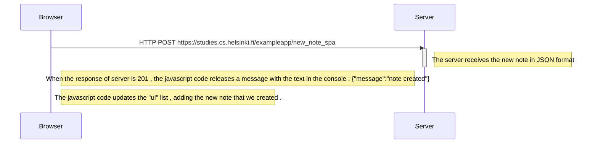

```mermaid
sequenceDiagram

participant A as Browser
participant B as Server

A ->> B :HTTP POST https://studies.cs.helsinki.fi/exampleapp/new_note_spa
activate B
Note right of B: The server receives the new note in JSON format 
deactivate B
Note right of A: When the response of server is 201 , the javascript code releases a message with the text in the console : {"message":"note created"}
Note right of A: The javascript code updates the "ul" list , adding the new note that we created .

 
```
